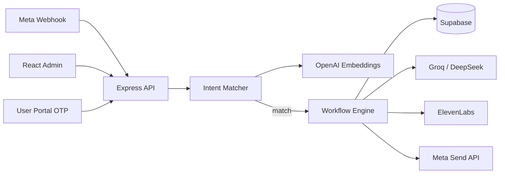

# WAutomate — Production WhatsApp Intent Bot

A production-ready WhatsApp chatbot built on the **Meta WhatsApp Cloud API (v18+)**, with **strict intent matching** (OpenAI embeddings + cosine similarity), **Groq / DeepSeek** for human-like replies, **ElevenLabs** voice messages, **Supabase** persistence, and a responsive **React + Vite** admin panel.

## Core behaviour

| Rule | Behaviour |
|------|-----------|
| Intent match | User message is embedded and compared to configured intents |
| Below threshold | **Complete silence** — no reply |
| Data collection | Each answer is saved to Supabase **before** the next question or any API call |
| Voice intents | ElevenLabs TTS → WhatsApp audio message → temp file cleanup |

## Architecture



## Stack

- **Frontend**: React 18, Vite, React Router, Recharts, Lucide
- **Backend**: Node.js, Express, Helmet, rate limiting
- **Database / Auth**: Supabase (PostgreSQL + RLS)
- **AI**: OpenAI (embeddings), Groq or DeepSeek (chat), configurable in admin
- **Voice**: ElevenLabs
- **Messaging**: Meta Graph API `v21.0` (configurable)

## Quick start (one command)

Clone the repo and run everything — backend, frontend, and PostgreSQL — with a single script:

```bash
git clone https://github.com/rushown/whatsapp-automation.git
cd whatsapp-automation
chmod +x dev.sh && ./dev.sh
```

Or run it directly without cloning first:

```bash
curl -fsSL https://raw.githubusercontent.com/rushown/whatsapp-automation/main/dev.sh | bash
```

The script will:
- Check Node.js and npm are installed
- Auto-start PostgreSQL (Mac/Linux) and create the `whatsapp_bot` database
- Copy `.env.example` → `backend/.env` if no `.env` exists
- Create `frontend/.env` with `VITE_API_URL=http://localhost:5000`
- Install all dependencies for both backend and frontend
- Start backend on **port 5000** and frontend on **port 3000**
- Print all URLs when ready

Press **Ctrl+C** to stop everything cleanly.

> **Requirements:** Node.js 18+, npm, PostgreSQL (optional — only needed if not using Supabase for the `api_keys` table)

## Project structure

```
whatsapp-automation/
├── dev.sh                    # One-command local dev startup
├── backend/src/
│   ├── index.js              # Server + webhook
│   ├── services/
│   │   ├── webhookProcessor.js
│   │   ├── intentMatcher.js
│   │   ├── embeddings.js
│   │   ├── aiProvider.js     # Groq + DeepSeek + OpenAI
│   │   ├── elevenLabs.js
│   │   ├── dataCollection.js
│   │   └── whatsappMeta.js
│   └── routes/               # intents, conversations, users, bot-config, portal
├── frontend/src/             # Admin + user portal UI
├── supabase/schema.sql       # Full DB schema + RLS
└── scripts/seed-admin.js
```

## Manual local setup

### 1. Clone and install

```bash
git clone https://github.com/rushown/whatsapp-automation.git
cd whatsapp-automation

cd backend && npm install
cd ../frontend && npm install
```

### 2. Environment variables

```bash
cp .env.example backend/.env
# Edit backend/.env with your keys
```

Required for full bot functionality:

| Variable | Purpose |
|----------|---------|
| `SUPABASE_URL` | Supabase project URL |
| `SUPABASE_SERVICE_ROLE_KEY` | Server-side DB access |
| `META_WHATSAPP_TOKEN` | Meta permanent token |
| `META_PHONE_NUMBER_ID` | WhatsApp phone number ID |
| `WEBHOOK_VERIFY_TOKEN` | Meta webhook verification |
| `OPENAI_API_KEY` | Intent embeddings |
| `GROQ_API_KEY` or `DEEPSEEK_API_KEY` | Response personalization |
| `ELEVENLABS_API_KEY` | Voice replies (optional) |

Frontend (`frontend/.env`):

```env
VITE_API_URL=http://localhost:5000
```

### 3. Supabase

1. Create a project at [supabase.com](https://supabase.com)
2. Enable **pgvector** extension (Database → Extensions)
3. Run `supabase/schema.sql` in the SQL Editor
4. Seed admin:

```bash
cd backend
node ../scripts/seed-admin.js
# Default: admin@example.com / Admin@1234
```

Without Supabase, the API falls back to in-memory storage and a local admin user (`admin@example.com` / `Admin@1234`).

### 4. Run

```bash
# Terminal 1 — API (port 5000)
cd backend && npm run dev

# Terminal 2 — Admin UI (port 3000)
cd frontend && npm run dev
```

- Admin: http://localhost:3000/login
- User portal: http://localhost:3000/portal

## Meta webhook configuration

1. In [Meta Developer Console](https://developers.facebook.com/) → your app → WhatsApp → Configuration
2. **Callback URL**: `https://YOUR-BACKEND-DOMAIN/webhook`
3. **Verify token**: same as `WEBHOOK_VERIFY_TOKEN` in `.env`
4. Subscribe to `messages`

Use [ngrok](https://ngrok.com/) for local testing:

```bash
ngrok http 5000
# Set callback URL to https://xxxx.ngrok.io/webhook
```

## Admin panel

| Page | Description |
|------|-------------|
| Dashboard | Messages handled, intents matched, voice sent, silent ignores |
| Intents | CRUD, examples, threshold, workflows (text / voice / collect / HTTP) |
| Conversations | Message log + collected data search |
| Users | Block / export WhatsApp users |
| Bot settings | AI provider (Groq/DeepSeek), human prompt, ElevenLabs voice |

Admin routes require `role: admin` in JWT.

## Intent workflows

1. **text** — Send configured text (optionally polished by AI)
2. **voice** — ElevenLabs script → WhatsApp audio
3. **collect_data** — Step-by-step fields; each saved to `collected_data` before continuing
4. **http** — POST collected payload to your URL after collection

## AI providers

Set in **Bot settings → AI provider**:

- **groq** — Fast Llama models (`GROQ_API_KEY`)
- **deepseek** — DeepSeek Chat (`DEEPSEEK_API_KEY`)
- **openai** — GPT-4o-mini for replies (`OPENAI_API_KEY`)

System prompt is editable for natural, human-like tone.

## Production deployment

### Backend (Render)

- New → Web Service → connect repo
- **Root Directory**: `backend`
- **Build Command**: `npm install`
- **Start Command**: `npm start`
- Set all env vars in Render dashboard

### Frontend (Vercel)

- New project → connect repo
- **Root Directory**: `frontend`
- **Build Command**: `npm run build`
- **Output Directory**: `dist`
- **Env**: `VITE_API_URL=https://your-api.onrender.com`

## Security checklist

- [ ] Strong `JWT_SECRET` (32+ random chars) — generate with `node -e "console.log(require('crypto').randomBytes(32).toString('hex'))"`
- [ ] Supabase service role key **only** on server
- [ ] RLS enabled (see `schema.sql`)
- [ ] Webhook verify token unique per environment
- [ ] Rate limiting enabled (default 300 req / 15 min in production)
- [ ] Change default admin password after seed

## Test login (local fallback)

- Email: `admin@example.com`
- Password: `Admin@1234`

## Testing

```bash
cd backend && npm test
# With API running:
SMOKE_BASE_URL=http://localhost:5000 npm test
```

## Production bot quality features

- **Strict silence** — no match or ambiguous top-2 intents → no reply
- **Webhook security** — `META_APP_SECRET` + `X-Hub-Signature-256`
- **Dedup** — Meta webhook retries ignored by message ID
- **Per-phone rate limit** — abuse protection (configurable)
- **Intent cache** — 60s TTL for fast matching at scale
- **Conversation reuse** — one open thread per phone in Supabase
- **Data-first collection** — every field persisted before next step

## License

MIT — use and modify for your business.