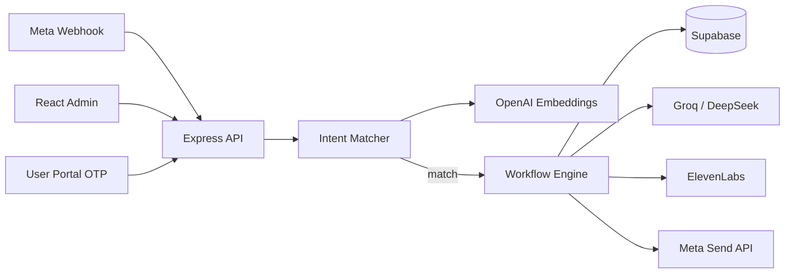

# WAutomate — Production WhatsApp Intent Bot

A production-ready WhatsApp chatbot built on the **Meta WhatsApp Cloud API (v18+)**, with **strict intent matching** (OpenAI embeddings + cosine similarity), **Groq / DeepSeek** for human-like replies, **ElevenLabs** voice messages, **Supabase** persistence, and a responsive **React + Vite** admin panel.

## Core behaviour

| Rule | Behaviour |
|------|-----------|
| Intent match | User message is embedded and compared to configured intents |
| Below threshold | **Complete silence** — no reply |
| Data collection | Each answer is saved to Supabase **before** the next question or any API call |
| Voice intents | ElevenLabs TTS → WhatsApp audio message → temp file cleanup |

## Architecture



## Stack

- **Frontend**: React 18, Vite, React Router, Recharts, Lucide
- **Backend**: Node.js, Express, Helmet, rate limiting
- **Database / Auth**: Supabase (PostgreSQL + RLS)
- **AI**: OpenAI (embeddings), Groq or DeepSeek (chat), configurable in admin
- **Voice**: ElevenLabs
- **Messaging**: Meta Graph API `v21.0` (configurable)

---

## Quick start (one command)

Clone and run everything — backend, frontend, and PostgreSQL — with a single script:

```bash
git clone https://github.com/rushown/whatsapp-automation.git
cd whatsapp-automation
chmod +x dev.sh && ./dev.sh
```

Or run directly without cloning:

```bash
curl -fsSL https://raw.githubusercontent.com/rushown/whatsapp-automation/main/dev.sh | bash
```

The script will:
- ✔ Check Node.js and npm
- ✔ Auto-start PostgreSQL and create the `whatsapp_bot` database
- ✔ Copy `.env.example` → `backend/.env` if missing
- ✔ Create `frontend/.env` with `VITE_API_URL=http://localhost:5000`
- ✔ Install all dependencies for backend and frontend
- ✔ Start backend on **:5000**, wait for health check, then start frontend on **:3000**
- ✔ Print all URLs when ready — **Ctrl+C** stops everything cleanly

> **Requirements:** Node.js 18+, npm, PostgreSQL (optional if using Supabase only)

---

## Project structure

```
whatsapp-automation/
├── dev.sh                        # One-command local dev startup
├── .env.example                  # Environment variable template
│
├── backend/
│   └── src/
│       ├── index.js              # Express server, webhook, routes
│       ├── config.js             # Environment configuration
│       ├── services/
│       │   ├── webhookProcessor.js   # Core bot logic
│       │   ├── intentMatcher.js      # Embedding + cosine similarity
│       │   ├── intentCache.js        # Hot-path 60s intent cache
│       │   ├── embeddings.js         # OpenAI embeddings
│       │   ├── aiProvider.js         # Groq / DeepSeek / OpenAI chat
│       │   ├── dataCollection.js     # Multi-step data collection forms
│       │   ├── whatsappMeta.js       # Meta Cloud API send
│       │   └── elevenLabs.js         # Voice TTS
│       ├── routes/
│       │   ├── auth.js               # JWT login
│       │   ├── intents.js            # Intent CRUD + embeddings
│       │   ├── conversations.js      # Message logs
│       │   ├── users.js              # WhatsApp user management
│       │   ├── botConfig.js          # AI + voice settings
│       │   ├── userPortal.js         # OTP user portal
│       │   ├── analytics.js          # Dashboard stats
│       │   ├── contacts.js           # Contact management
│       │   ├── templates.js          # Message templates
│       │   ├── apiKeys.js            # Per-user key storage
│       │   ├── whatsapp.js           # Manual send from admin
│       │   └── documentFlows.js      # In-memory doc flows (optional)
│       └── lib/
│           ├── supabase.js           # Supabase client
│           ├── db.js                 # PostgreSQL pool (api_keys table)
│           ├── logger.js             # Structured logger
│           └── webhookSecurity.js    # Meta signature verification
│
├── frontend/
│   ├── index.html                # Vite entry + SEO
│   └── src/
│       ├── App.jsx               # Routing
│       ├── components/
│       │   └── Layout.jsx        # Shell + nav
│       └── pages/
│           ├── LoginPage.jsx         # Auth
│           ├── DashboardPage.jsx     # Stats overview
│           ├── IntentsPage.jsx       # Intent CRUD
│           ├── BotSettingsPage.jsx   # AI + voice config
│           ├── ConversationsPage.jsx # Message logs
│           └── UsersPage.jsx         # User management
│
├── supabase/
│   └── schema.sql                # Full DB schema + RLS policies
│
└── scripts/
    └── seed-admin.js             # Seeds default admin user
```

### File reference

#### Required for production bot

| Path | Purpose |
|------|---------|
| `backend/src/index.js` | Express server, webhook, routes |
| `backend/src/config.js` | Environment configuration |
| `backend/src/services/webhookProcessor.js` | Core bot logic |
| `backend/src/services/intentMatcher.js` | Embedding intent matching |
| `backend/src/services/intentCache.js` | Hot-path intent cache |
| `backend/src/services/embeddings.js` | OpenAI embeddings |
| `backend/src/services/aiProvider.js` | Groq / DeepSeek / OpenAI chat |
| `backend/src/services/dataCollection.js` | Multi-step forms |
| `backend/src/services/whatsappMeta.js` | Meta Cloud API send |
| `backend/src/services/elevenLabs.js` | Voice TTS |
| `backend/src/lib/supabase.js` | Database client |
| `supabase/schema.sql` | Database schema + RLS |

#### Required for admin UI

| Path | Purpose |
|------|---------|
| `frontend/index.html` | Vite entry + SEO |
| `frontend/src/App.jsx` | Routing |
| `frontend/src/components/Layout.jsx` | Shell + nav |
| `frontend/src/pages/IntentsPage.jsx` | Intent CRUD |
| `frontend/src/pages/BotSettingsPage.jsx` | AI + voice config |
| `frontend/src/pages/ConversationsPage.jsx` | Logs |
| `frontend/src/pages/UsersPage.jsx` | User management |

#### Optional / legacy

| Path | Purpose |
|------|---------|
| `backend/src/routes/documentFlows.js` | Simple in-memory doc flows |
| `backend/src/documentFlowStore.js` | Store for document flows |
| `backend/src/routes/whatsapp.js` | Manual send from admin |
| `backend/src/templates/coverletter.html` | Unused asset (safe to delete) |

#### Removed — do not restore

| Path | Reason |
|------|--------|
| `file/` | Duplicate broken copies; logic lives under `backend/src/` |
| `chunks.txt` | Scratch notes |
| `documentFlowEngine.js` | Broken imports |
| `groqParser.js` / `metaApi.js` | Replaced by `aiProvider.js` / `whatsappMeta.js` |
| `frontend/src/components/Sidebar.jsx` | Unused — Layout has nav |

---

## Manual local setup

### 1. Clone and install

```bash
git clone https://github.com/rushown/whatsapp-automation.git
cd whatsapp-automation

cd backend && npm install
cd ../frontend && npm install
```

### 2. Environment variables

```bash
cp .env.example backend/.env
# Edit backend/.env with your keys
```

Required for full bot functionality:

| Variable | Purpose |
|----------|---------|
| `SUPABASE_URL` | Supabase project URL |
| `SUPABASE_SERVICE_ROLE_KEY` | Server-side DB access |
| `META_WHATSAPP_TOKEN` | Meta permanent token |
| `META_PHONE_NUMBER_ID` | WhatsApp phone number ID |
| `WEBHOOK_VERIFY_TOKEN` | Meta webhook verification |
| `OPENAI_API_KEY` | Intent embeddings |
| `GROQ_API_KEY` or `DEEPSEEK_API_KEY` | Response personalization |
| `ELEVENLABS_API_KEY` | Voice replies (optional) |

Frontend (`frontend/.env`):

```env
VITE_API_URL=http://localhost:5000
```

### 3. Supabase

1. Create a project at [supabase.com](https://supabase.com)
2. Enable **pgvector** extension (Database → Extensions)
3. Run `supabase/schema.sql` in the SQL Editor
4. Seed admin:

```bash
cd backend
node ../scripts/seed-admin.js
# Default: admin@example.com / Admin@1234
```

Without Supabase the API falls back to in-memory storage and a local admin user.

### 4. Run

```bash
# Terminal 1 — API (port 5000)
cd backend && npm run dev

# Terminal 2 — Admin UI (port 3000)
cd frontend && npm run dev
```

- Admin: http://localhost:3000/login
- User portal: http://localhost:3000/portal

---

## Meta webhook configuration

1. [Meta Developer Console](https://developers.facebook.com/) → your app → WhatsApp → Configuration
2. **Callback URL**: `https://YOUR-BACKEND-DOMAIN/webhook`
3. **Verify token**: same as `WEBHOOK_VERIFY_TOKEN` in `.env`
4. Subscribe to `messages`

Use [ngrok](https://ngrok.com/) for local testing:

```bash
ngrok http 5000
# Set callback URL to https://xxxx.ngrok.io/webhook
```

---

## Admin panel

| Page | Description |
|------|-------------|
| Dashboard | Messages handled, intents matched, voice sent, silent ignores |
| Intents | CRUD, examples, threshold, workflows (text / voice / collect / HTTP) |
| Conversations | Message log + collected data search |
| Users | Block / export WhatsApp users |
| Bot settings | AI provider (Groq/DeepSeek), human prompt, ElevenLabs voice |

Admin routes require `role: admin` in JWT.

## Intent workflows

1. **text** — Send configured text (optionally polished by AI)
2. **voice** — ElevenLabs script → WhatsApp audio
3. **collect_data** — Step-by-step fields; each saved to `collected_data` before continuing
4. **http** — POST collected payload to your URL after collection

## AI providers

Set in **Bot settings → AI provider**:

- **groq** — Fast Llama models (`GROQ_API_KEY`)
- **deepseek** — DeepSeek Chat (`DEEPSEEK_API_KEY`)
- **openai** — GPT-4o-mini for replies (`OPENAI_API_KEY`)

---

## Production deployment

### Backend (Render)

- New → Web Service → connect repo
- **Root Directory**: `backend`
- **Build Command**: `npm install`
- **Start Command**: `npm start`
- Set all env vars in the Render dashboard Environment tab

### Frontend (Vercel)

- New project → connect repo
- **Root Directory**: `frontend`
- **Build Command**: `npm run build`
- **Output Directory**: `dist`
- **Env**: `VITE_API_URL=https://your-api.onrender.com`

---

## Security checklist

- [ ] Strong `JWT_SECRET` (32+ chars) — generate with:
  ```bash
  node -e "console.log(require('crypto').randomBytes(32).toString('hex'))"
  ```
- [ ] Supabase service role key **only** on server — never in frontend
- [ ] RLS enabled on all tables (see `schema.sql`)
- [ ] Unique `WEBHOOK_VERIFY_TOKEN` per environment
- [ ] Rate limiting enabled (default 300 req / 15 min in production)
- [ ] Change default admin password after seeding

## Test login (local fallback)

- Email: `admin@example.com`
- Password: `Admin@1234`

## Testing

```bash
cd backend && npm test
# With server running:
SMOKE_BASE_URL=http://localhost:5000 npm test
```

---

## Production bot quality features

- **Strict silence** — no match or ambiguous top-2 intents → no reply
- **Webhook security** — `META_APP_SECRET` + `X-Hub-Signature-256`
- **Dedup** — Meta webhook retries ignored by message ID
- **Per-phone rate limit** — abuse protection (configurable)
- **Intent cache** — 60s TTL for fast matching at scale
- **Conversation reuse** — one open thread per phone in Supabase
- **Data-first collection** — every field persisted before next step

## License

MIT — use and modify for your business.